# 메타마스크 시작하기

크롬, 혹은 파이어폭스에서 확장 플러그인을 설치해야 합니다.
여기서는 크롬을 예로 듭니다.

크롬 브라우저로 [크롭 웹 스토어 Metamas](https://chrome.google.com/webstore/detail/metamask/nkbihfbeogaeaoehlefnkodbefgpgknn) 확장을 설치합니다.

## 계정 생성

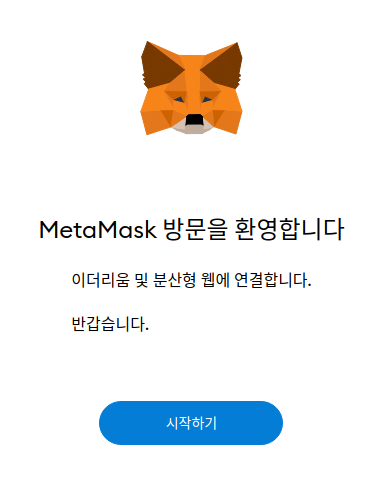

설치 후, 위 그림과 같은 탭이 생성됩니다. '시작하기' 버튼을 눌러 진행합니다.

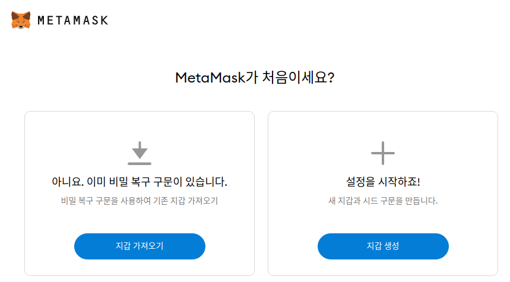

처음 설치면 '지갑 새성'을 눌러 진행합니다.

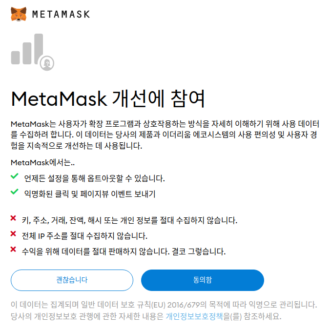

Metamask 개선 참여 프로그램에 동의할지 말지를 묻습니다. 어느 쪽의 버튼을 눌러도 관계 없습니다.

암호를 생성합니다. 8자 이상의 암호를 생성하여 '새 암호'란과 '암호 확인'란에 똑같이 입력합니다.
이용 약관에 체크하면 '생성' 버튼이 활성화됩니다. 클릭하여 진행합니다.

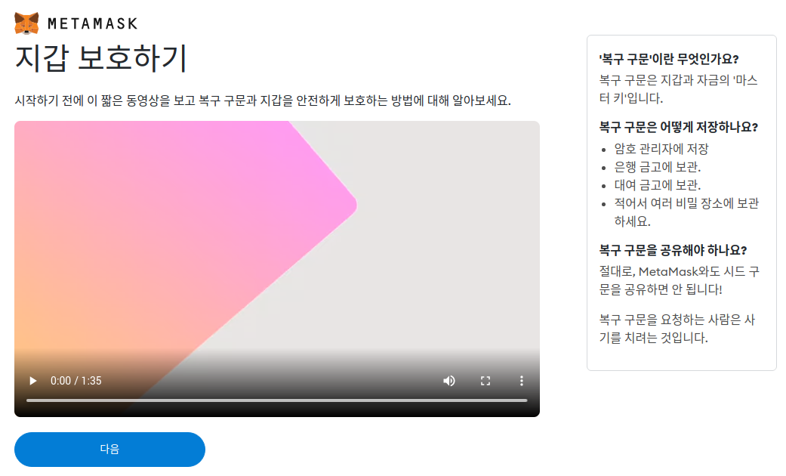

지갑을 보호하기 위한 방법에 대한 안내 동영상입니다. 한 번도 보지 않으셨다면 시청하세요.
요약된 내용이 오른쪽에 표시되는데,

* 복구 구문은 '마스터 키'.
* 절대 노출하지 말 것.
* 절대 누설하지 말 것.

입니다.

숙지하셨다면 다음을 눌러 진행합니다.

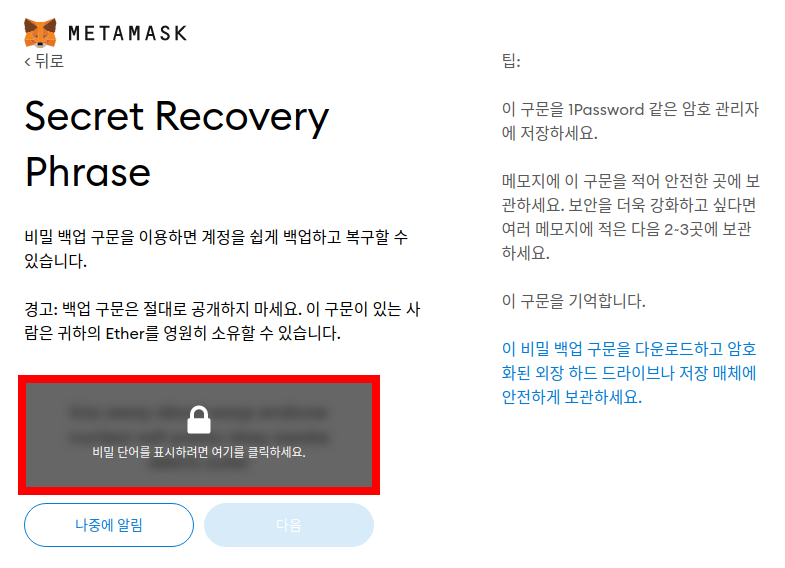

붉은 색으로 하이라이트된 영역을 클릭하면 '복구 구문'을 조회할 수 있습니다.

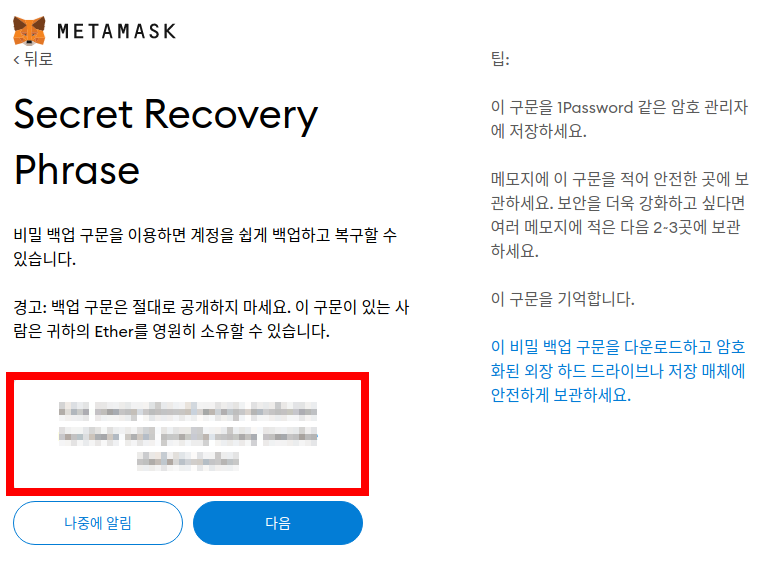

지금 바로 어딘가 안전한 곳에 이 구문을 기록하세요. 기록이 잘 되었다면, 다음을 눌러 진행합니다.

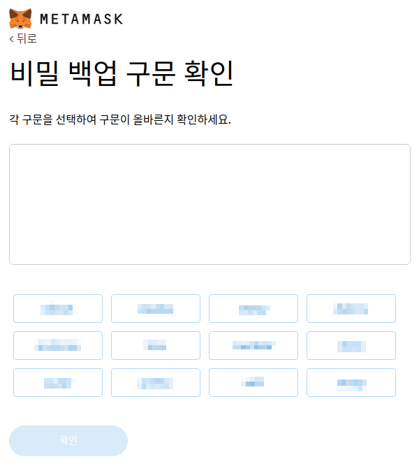

이제 이 구문을 올바르게 기록했는지 확인합니다. 기록한 단어 순서대로 버튼을 누릅니다.
기억력 테스트 게임이 아닙니다. 기록과 잘 대조하세요.

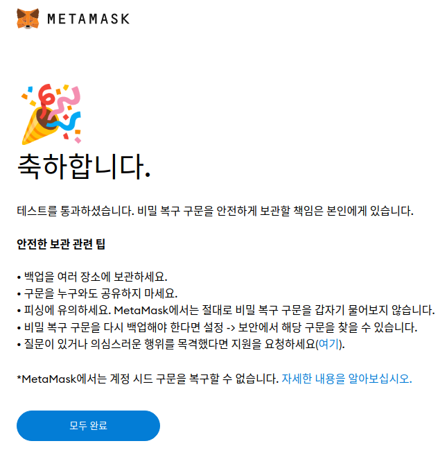

생성이 끝났습니다. '모두 완료' 버튼을 눌러 다음으로 진행합니다.

## 테스트 네트워크 가입  테스트 ETH 구매

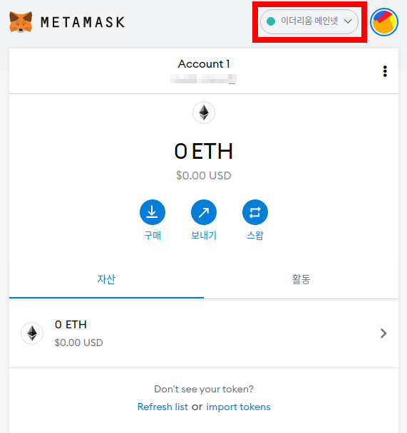

생성 후에는 위 그림과 같은 대시보드로 이동하게 됩니다. 붉은색으로 하이라이트한 부분을 클릭합니다.

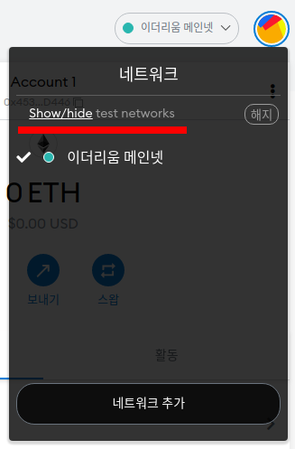

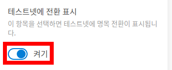

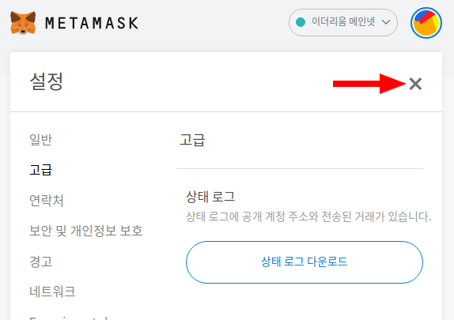

Show/hide 부분을 클락하세요. 그러면 '테스트넷에 전환 표시' 부분으로 이동합니다. '켜기'로 활성화합니다.
이후 화면을 가장 위로 올린다음 X 표시를 눌러 설정 화면을 닫습니다.

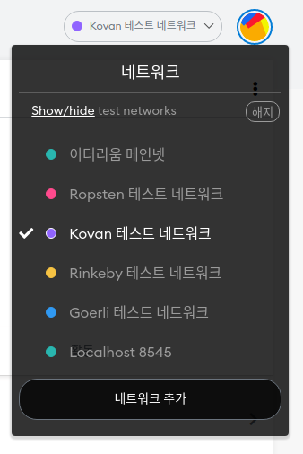

테스트 네트워크 중 하나를 선택합니다. 여기서는 Kovan 테스트 네트워크를 선택했습니다.

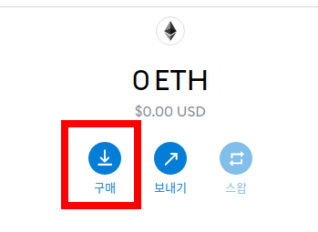

구매 버튼을 누릅니다.

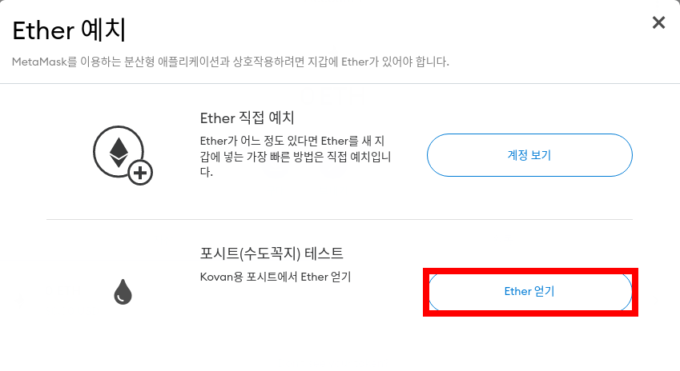

포시트 테스트를 선택합니다.

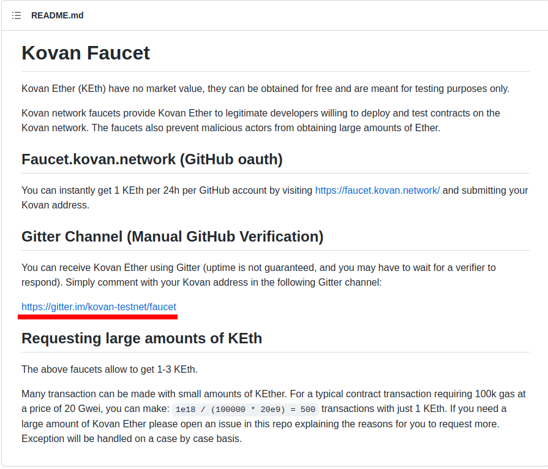

Github 문서 페이지로 이동하게 됩니다. 여기서 밑줄친 링크로 이동합니다.

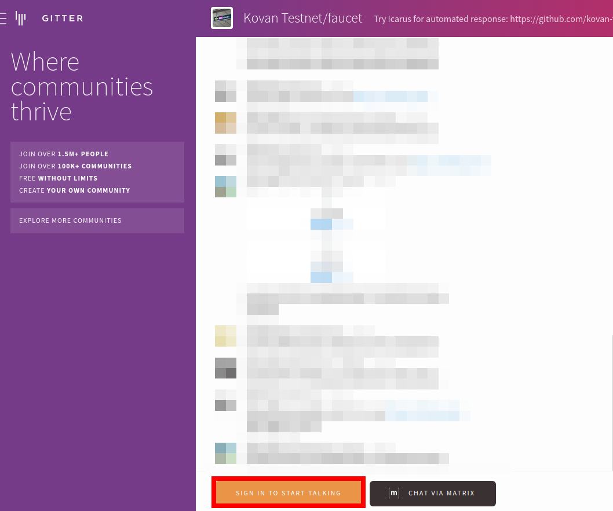

화면 아래 Signin to start talking 버튼을 누릅니다.

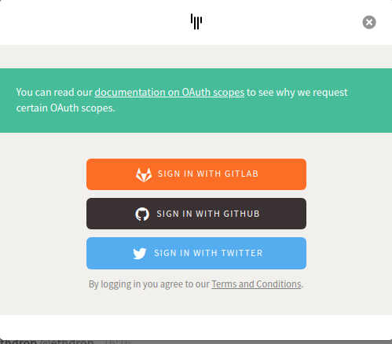

Gitlab, github, twitter 중 하나로 로그인할 수 있습니다. 택일하여서 로그인하세요.

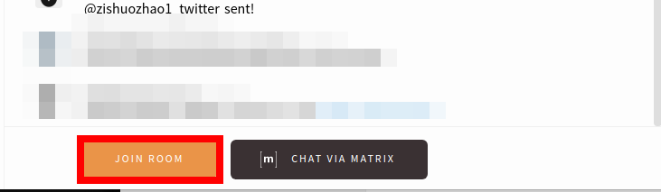

로그인하면 화면 아래 황색 버튼이 'Join Room'으로 변경되어 있습니다. 클릭하세요.

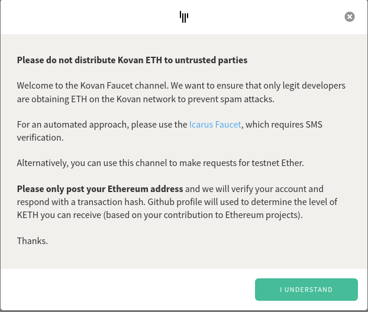

위와 같은 안내창이 열립니다. 'I understand' 버튼을 눌러 진행합니다.

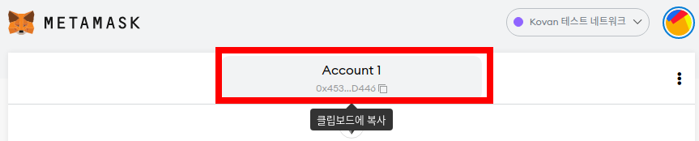

Metamask 창으로 돌아와 위 그림처럼 하이라이트한 부분을 클릭하면 지갑 주소가 클립보드에 복사됩니다.

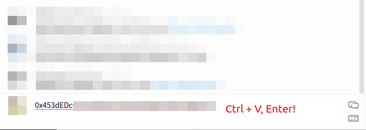

주소를 복사해 붙여넣고 Enter 키를 누르고, 잠시 대기합니다.

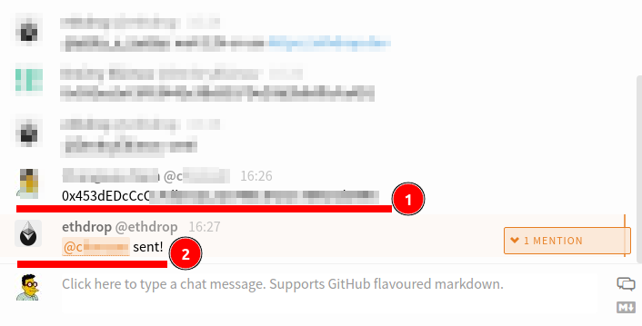

입금되었다는 메시지가 나옵니다.

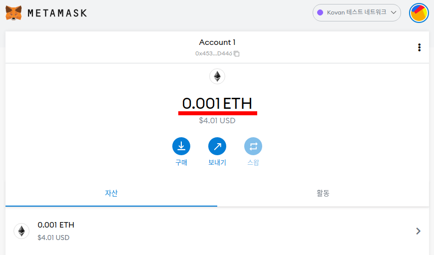

Metamask 화면에서도 확인해 봅니다.
이렇게 채팅창에 입력하는 방식은 24시간마다 1번만 사용할 수 있습니다.

다른 방법으로는 https://ethdrop.dev/ 에서 0.001 ETH 씩 얻을 수 있습니다. 여기는 24시간 시간 제한이 없지만, 리캡챠를 통과해야 합니다.

